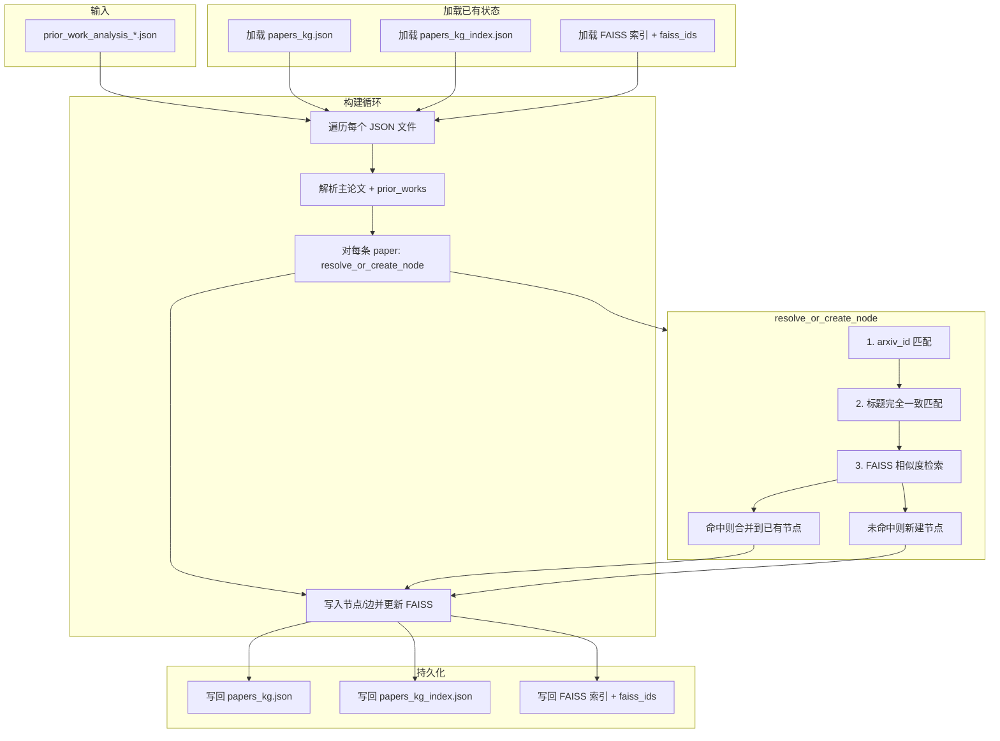
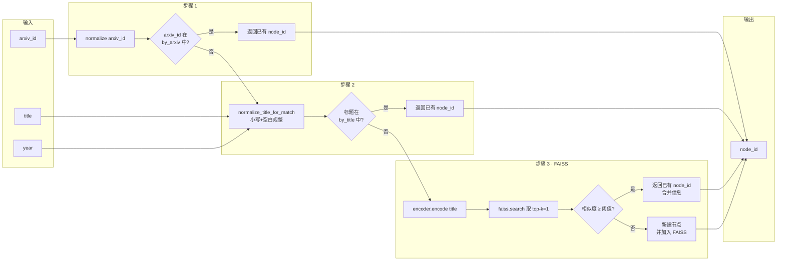
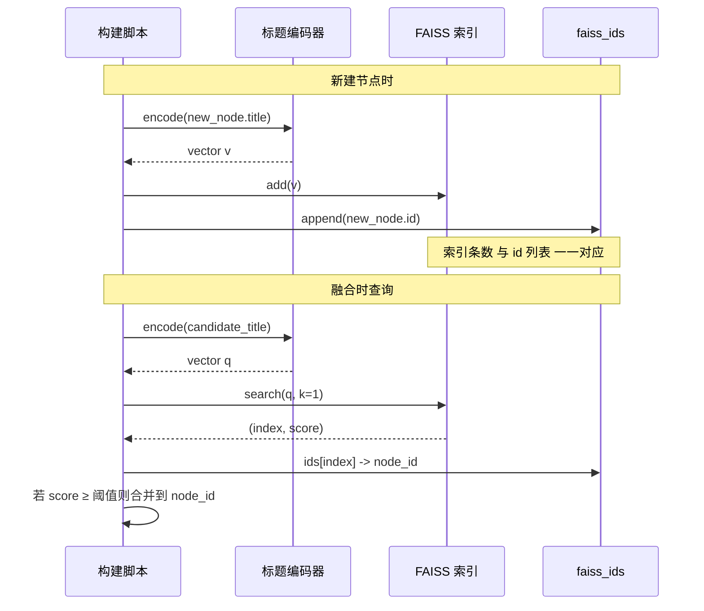

# 基于 FAISS 的标题相似度融合技术方案

## 1. 目标与背景

- **目标**：在知识图谱构建/增量融合时，将「同一篇论文、不同标题写法」的节点合并为一个节点，减少图中重复实体。
- **现状**：已支持按 `arxiv_id`、按标题完全一致（忽略大小写）融合；对表述差异较大的同篇论文（如 "DeepSeek-R1: Incentivizing..." 与 "DeepSeek-R1 incentivizes reasoning in LLMs through..."）仍会生成重复节点。
- **思路**：用标题的**向量表示**做语义相似度检索，每入图一个节点就把其 title 的向量存入 FAISS；新 paper 融合时先与 FAISS 中已有标题做相似度检索，高于阈值则判定为同一论文并融合。

---

## 2. 技术选型

| 组件 | 选型 | 说明 |
|------|------|------|
| 向量检索 | **FAISS** (Facebook AI Similarity Search) | 高维向量近邻检索，支持增量 add、持久化保存与加载，适合万级以内规模。 |
| 标题向量化 | **allenai-specter**（sentence_transformers 加载） | 学术文本语义编码，对论文标题/摘要等效果较好；输出 768 维向量，用余弦相似度衡量标题相似度。 |
| 持久化 | FAISS 索引文件 + ID 映射 JSON | 索引与图谱一起放在 `public/graph/`（或 `backend` 输出目录），便于全量/增量复用。 |

标题编码与相似度示例（实现时参考）：

```python
from sentence_transformers import SentenceTransformer
from sklearn.metrics.pairwise import cosine_similarity

model = SentenceTransformer('allenai-specter')
emb1 = model.encode([title1])
emb2 = model.encode([title2])
score = cosine_similarity(emb1, emb2)[0][0]  # 余弦相似度，用于与阈值比较
```

---

## 3. 数据与文件

- **FAISS 索引**：`public/graph/papers_kg_faiss.index`（或 `papers_kg_title.index`）  
  - 每行对应一个**已入图节点**的标题向量；使用 **allenai-specter** 时维度为 **768**。
- **ID 映射**：`public/graph/papers_kg_faiss_ids.json`  
  - 数组或列表，下标 `i` 对应 FAISS 中第 `i` 条向量，值为图中**节点 id**（`node_id`），用于检索到 index 后反查节点。
- **融合顺序**（不变）：  
  1) 先按 **arxiv_id** 匹配；  
  2) 再按 **标题完全一致（小写）** 匹配；  
  3) **新增**：按 **FAISS 标题相似度** 匹配（仅在前两步未命中时执行）。

---

## 4. 主流程（Mermaid）

### 4.1 全量构建 / 增量构建总览



### 4.2 单条 paper 的融合决策（resolve_or_create_node + FAISS）



### 4.3 节点入图时与 FAISS 的交互



---

## 5. 关键实现要点

### 5.1 相似度与阈值

- **向量化**：使用 **allenai-specter**（`SentenceTransformer('allenai-specter')`）对标题编码，得到 768 维向量；学术标题/摘要场景下语义区分度较好。
- **相似度**：使用 **余弦相似度**（`cosine_similarity(emb1, emb2)` 或 FAISS 检索时等价的内积，需先对向量 L2 归一化）。
- **FAISS 检索**：向量可先 L2 归一化后建 IndexFlatIP（内积即余弦）；或使用 IndexFlatL2 并做相似度换算。检索 top-k=1，取分数与阈值比较。
- **阈值**：建议默认在 **0.85–0.92** 之间可配置；过高仍会漏合，过低可能误合不同论文。可根据融合日志中的「faiss score」抽样调参。

### 5.2 增量与全量

- **全量**：从头构建时，先清空或新建 FAISS 索引与 faiss_ids；每确定一个最终节点（新建或合并后的代表节点）后，用其**当前 title** 编码并 add 一次，同时 append 其 node_id 到 faiss_ids。
- **增量**：加载已有 `papers_kg.json` 与 FAISS、faiss_ids；仅对**新增/更新的 analysis 文件**跑融合；新产生的节点同样 encode+add+append；若某节点被合并（其 id 不再作为代表），无需从 FAISS 删除（检索到后仍指向代表 id，不影响正确性），可选在下次全量重建时清理。

### 5.3 ID 映射一致性

- FAISS 的 `ntotal` 必须与 `faiss_ids` 长度一致；每次 `add` 后 append 一个 node_id。
- 合并时：只保留「代表节点」在图中；其 title 已存在于 FAISS 的某条，无需重复 add；被合并掉的节点不再向 FAISS 添加（避免重复向量）。

### 5.4 融合日志

- 每次发生融合时打印日志，便于判断「谁和谁合并了」以及后续调整阈值：
  - **title**：`[FUSION] title: "入图标题..." -> node_id=xxx (existing: "已有标题...")`
  - **arxiv**：`[FUSION] arxiv: "入图标题..." -> node_id=xxx (existing: "已有标题...")`
  - **faiss**（实现时）：`[FUSION] faiss score=0.91: "入图标题..." -> node_id=xxx (existing: "已有标题...")`
- 可选：在构建结束时汇总各类型融合次数，便于调参。

### 5.5 依赖与存储

- **Python**：`faiss-cpu`（或 `faiss-gpu`）、`sentence-transformers`（用于加载 **allenai-specter**）、`scikit-learn`（用于 `cosine_similarity`，或自算余弦）。
- **模型**：`SentenceTransformer('allenai-specter')`，首次运行会从 HuggingFace 拉取，需网络或镜像。
- **存储**：FAISS 写入 `IndexFlatIP`（向量 L2 归一化后内积即余弦）或 `IndexFlatL2` 后保存为 `.index` 文件；faiss_ids 存为 JSON 数组，与现有 `papers_kg.json`、`papers_kg_index.json` 同目录，便于备份与版本一致。

---

## 6. 与现有方案的衔接

- 本方案作为**第三步融合**接入现有 `build_knowledge_graph.py`：在 `_resolve_or_create_node` 中，当 `by_arxiv`、`by_title` 均未命中时，再执行「encode(title) → FAISS search → 阈值判断」；若命中则返回已有 node_id 并做信息合并，否则新建节点并在**写入图后**对该节点 title 做一次 encode + FAISS add + faiss_ids append。
- 现有「标题完全一致（小写）」逻辑保留，与 FAISS 并行存在：先快速匹配，再语义匹配，兼顾性能与召回。

---

## 7. 风险与缓解

| 风险 | 缓解 |
|------|------|
| 误合不同论文 | 阈值不宜过低；可仅对「无 arxiv_id」的 prior 做 FAISS 融合，降低误伤。 |
| 索引与图不一致 | 全量重建时从图重建 FAISS；增量时严格保证 add 与 faiss_ids 同步。 |
| 编码/检索耗时 | 批量 encode、FAISS 单次 add 多条；增量时只对新出现的 title 做 encode 与 search。 |

以上为基于 FAISS 的标题相似度融合技术方案，主流程已用 Mermaid 表示；实现时可在 `docs/knowledge-graph-design.md` 中增加「3.x 标题相似度（FAISS）」小节并引用本文档。
